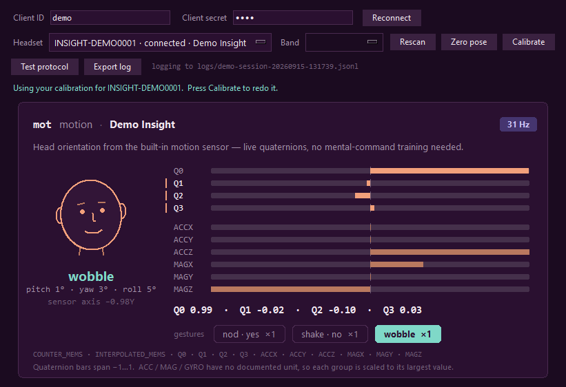

# Cortex quaternion viewer

A small desktop app that shows the **head motion** of an EMOTIV headset in real time. It draws
a head that follows yours, the live quaternion and raw motion sensors, and recognises **nods,
headshakes and head wobbles**.



## Purpose

EMOTIV headsets stream motion data through the **Cortex API** (the local service that runs
inside the EMOTIV Launcher). Using that data correctly is harder than it looks:

- **Each headset holds its motion sensor differently.** Cortex does not document the sensor's
  axes. On an MN8 earbud the sensor sits ~37° off the head's axes, so a plain head turn also
  shows up as looking down and leaning.
- **Some headsets change with how they are worn.** Moving the EPOC X band from horizontal to
  vertical rotates the sensor ~82°, so turning and leaning swap axes.
- **Streams differ per device:** 6.4 Hz on MN8, 32–64 Hz on Insight and EPOC X; quaternions
  on some units, gyroscope values on older ones.

This app is a working reference for handling all of that. It converts the raw data into real
head movement (turn, nod, lean), measures each headset's axes with a short calibration, and
records logs so headsets you don't own can be tested remotely.

## Features

- **Connects to Cortex:** pick a headset and see its motion right away.
- **Live display:** a head drawing that turns, nods and leans with you; pitch / yaw / roll in
  degrees; bars for Q0–Q3 and the accelerometer / magnetometer; the measured sample rate.
- **Calibration:** five short holds (forward, up, down, left, right) measure how the sensor
  sits on *this* head. The result is saved per headset, and per band position for EPOC X.
- **Gesture detection:** nod (yes), headshake (no) and head wobble (ear toward alternate
  shoulders), with counters.
- **Test protocol:** a guided ~2-minute recording with labelled steps, for checking gesture
  detection on a real head.
- **Session logs** of every raw sample and event, with a one-click **Export log** zip to send.
- **Demo mode:** synthetic motion, no headset or Launcher needed.

## Requirements

- **Python 3.10 or newer**, with Tkinter. Tkinter is included in the python.org installers
  for Windows and macOS; on Linux, install your distribution's `python3-tk` package.
- The [`websocket-client`](https://pypi.org/project/websocket-client/) package (the only dependency).
- For a real headset:
  - the **EMOTIV Launcher** installed, running and signed in with your EmotivID;
  - a **Cortex app** registered with your EmotivID, which gives you a *Client ID* and *Client
    secret*;
  - the headset paired and visible in the Launcher.

## Install and run

```bash
pip install -r requirements.txt
python quaternion_viewer.py
```

To try it without a headset:

```bash
python quaternion_viewer.py --demo
```

On Windows, if `python` opens a different interpreter (some programs bundle their own), use
the Python launcher instead: `py -3 -m pip install -r requirements.txt` and
`py -3 quaternion_viewer.py`. On macOS and Linux, use `python3` if `python` is missing.

To skip typing your credentials each time, set these environment variables before starting
the app and the fields fill in by themselves:

| Variable | Value |
|---|---|
| `CORTEX_CLIENT_ID` | your Cortex app's Client ID |
| `CORTEX_CLIENT_SECRET` | your Cortex app's Client secret |

## Using the app

1. **Connect.** Enter the Client ID and Client secret, then click **Connect**. The first time,
   the EMOTIV Launcher asks you to approve the app.
2. **Pick your headset** in the **Headset** list. The list fills in as the Bluetooth scan finds
   headsets, which can take up to ~20 s; **Rescan** starts a new scan.
3. **Band** (EPOC X only): choose *horizontal* or *vertical* to match how you wear it. Each
   position has its own calibration, and the app remembers your last choice per headset.
4. **Calibration** runs by itself the first time you use a headset (or band position). Follow
   the prompts under the buttons, returning to face the screen before each move:
   face forward and hold still → look **up** → look **down** → turn **left** → turn **right**.
   Hold each position about a second; it advances by itself. Press **Calibrate** to redo it anytime.
5. **Watch.** The word under the head says *still*, *turning*, *nodding* or *tilting*. It turns
   green during a gesture (*nod · yes*, *shake · no*, *wobble*), and the gesture counters
   update. *sensor axis* shows which raw sensor axis you are rotating about.
6. **Zero pose** makes your current head position the new "forward".

### Test protocol and sending a log

Click **Test protocol** and follow the prompts in the status line (~105 s):
get ready (4 s) · hold still (10 s) · nod about 5 times (12 s) · rest (5 s) · shake about 5 times (12 s) ·
rest (5 s) · wobble about 5 times (12 s) · rest (5 s) · look around naturally (20 s) · talk out loud (20 s).
Each step is written into the log as a marker. Click **Stop test** to cancel.

Then click **Export log**. The app creates `cortex-motion-log-<headset>-<time>.zip` next to
`quaternion_viewer.py` and shows it in your file manager. It contains this session's log and
your calibration file. When sending it, also mention the headset model and how it was worn.

## Where data is saved

Everything is saved **next to `quaternion_viewer.py`**, and nothing is uploaded anywhere.

| Path | What it holds | Written when |
|---|---|---|
| `head_axes.json` | Calibrations, and the last band position per headset | After each calibration; when Band changes |
| `logs/session-YYYYMMDD-HHMMSS.jsonl` | One log per app run (`demo-session-…` in demo mode) | Continuously while the app runs |
| `cortex-motion-log-<headset>-<time>.zip` | That session's log + `head_axes.json` | When you click **Export log** |

All three are listed in `.gitignore`: they are personal data, not source code.

**Never saved:** your Client ID, Client secret, Cortex access token, or the Launcher's user
names. No EEG / brain data is requested at all; the app subscribes only to the motion stream.

### `head_axes.json`

```json
{
  "headsets": {
    "EPOCX-XXXXXXXX:vertical": {
      "headset": "EPOCX-XXXXXXXX",
      "family": "EPOCX",
      "fit": "vertical",
      "axes": { "roll": [x, y, z], "pitch": [x, y, z], "yaw": [x, y, z] },
      "gravity_forward": [x, y, z],
      "calibrated": "2026-09-14 17:42:19",
      "history": [ { "...": "earlier calibrations, newest first (up to 20)" } ]
    }
  },
  "last_fit": { "EPOCX-XXXXXXXX": "vertical" }
}
```

- **Keys:** the headset ID, plus `:<fit>` for headsets worn in more than one way.
- **`axes`:** the head's roll (nose), pitch (ear-to-ear) and yaw (vertical) axes, written in the
  sensor's coordinates. Recalibrating moves the previous result into `history` instead of
  deleting it.
- **`gravity_forward`:** the normalised accelerometer reading while facing forward, if the
  headset sends one.

Delete the file to start over.

### Session logs (`logs/*.jsonl`)

One JSON object per line. Every line has `type` and `t_local` (computer time, seconds).

| `type` | Contents |
|---|---|
| `session` | App version, Python version, OS, demo flag |
| `cortex_info` | Cortex version and build |
| `headsets` | Full `queryHeadsets` entries: ID, status, firmware, `motionSensors`, `settings` (rates) |
| `subscribe` | Subscription result: the stream's column names (`cols`) and any failure |
| `setup` | Axes used, and where they came from (`saved`, `family`, `default`, `guess`) |
| `mot` | One motion sample: `t` (Cortex time) and `v` (raw values, in `cols` order) |
| `rate` | Measured sample rate, every 5 s |
| `calibration_step`, `calibration`, `calibration_failed` | Each step; the result with raw moves, neutral pose and gravity |
| `fit`, `zero_pose` | Band changes; Zero pose presses |
| `gesture` | A detected nod / shake / wobble |
| `marker` | Test protocol: `protocol_start`, `step_start:<step>`, `step_end:<step>`, `protocol_end` (gestures per step) |
| `warning`, `error`, `lost`, `no_data` | Cortex warnings, errors, disconnects; no samples 5 s after subscribing |
| `export`, `end` | Log exported; app closed |

## How it works

### 1. Talking to Cortex

Cortex is a JSON-RPC service over a secure WebSocket at `wss://localhost:6868`. Its
certificate comes from EMOTIV's own certificate authority, so the app skips certificate checks
for this localhost connection only. A background thread reads messages: replies carry an `id`,
stream samples carry a `sid`, and warnings carry `warning`.

Connection flow:

```
getUserLogin                      is someone signed in to the Launcher?
hasAccessRight / requestAccess    approve the app in the Launcher (once), polled every 2 s
authorize                         → Cortex token
controlDevice refresh + queryHeadsets    scan, polled for ~20 s
controlDevice connect             if the picked headset is only "discovered"
createSession (status "open")     enough for motion data
subscribe ["mot"]                 → column names, then samples
```

Values are always read **by column name** from the `subscribe` result, never by position,
because columns differ between headsets.

### 2. Quaternion → head pose

For every sample:

1. **Read Q0–Q3** (Q0 is w). Values whose magnitude is below 0.2 are placeholders from a
   sensor that hasn't settled, so they are skipped; the rest are normalised.
2. **Relative to "forward":** `rel = conj(neutral) ⊗ q`, where `neutral` is the pose at start,
   at calibration or at Zero pose. Subtracting Euler angles instead goes wrong as soon as more
   than one axis moves.
3. **Convert to head axes** using the headset's axis rows (next section):
   `head = (w, rows · (x, y, z))`.
4. **Euler angles:** roll = rotation about the nose axis, pitch = about the ear-to-ear axis,
   yaw = about the vertical axis. Convention: +yaw = turn right, +pitch = look down.
5. **Display smoothing:** each frame, the drawn pose moves 35% of the way toward the newest pose
   (normalised linear interpolation). That keeps MN8's 6.4 Hz smooth and still keeps up at 64 Hz.
6. **Motion word:** per-axis angular speed, smoothed. Below 12°/s it says *still*; otherwise the
   fastest axis names the movement.

### 3. Head axes and calibration

Cortex doesn't say how the motion sensor is oriented inside each headset, and swapping axis
names is not enough: a tilted sensor mixes every head movement across sensor axes. So the
app **measures** it:

1. Face forward and hold still → `neutral`.
2. Look up, look down, turn left, turn right, each held still (1 s within 4°), past a minimum
   angle (15° up/down, 25° left/right), and each starting from forward again. Each hold gives a
   rotation vector in sensor coordinates.
3. `nod = down − up` and `turn = right − left`. Subtracting the opposite moves cancels most of
   the sideways wobble that real movements have.
4. `yaw = normalize(turn)`; `pitch = normalize(nod − (nod·yaw)·yaw)`, keeping only the part
   perpendicular to yaw; `roll = pitch × yaw`. That always gives a proper rotation. The calibration
   is rejected if the turn and the nod point the same way.

In a simulation with a sensor tilted 25° and deliberately imprecise moves, a 40° right turn
read as (roll −10°, pitch 13°, yaw 36°) before calibration and (4°, −1°, 40°) after.

Built-in starting points, measured on real heads with this calibration (one unit each):

| Headset | Turn (yaw) | Nod (pitch) | Lean (roll) | Sensor offset |
|---|---|---|---|---|
| Insight 2 | −X | +Z | −Y | 7–11° |
| MN8 | −0.80Y −0.57X | +0.98Z | +0.82X −0.56Y | ~37° (earbud sits at an angle) |
| EPOC X, band horizontal | −X | +Z | −Y | 4–15° |
| EPOC X, band vertical | +Y | +Z | −X | 6–7° |

The EPOC X band pivots at the ears, so switching position rotates the sensor ~82° about the
ear-to-ear axis. Nodding is unaffected, but turning and leaning swap; worn vertical with the
horizontal setup, a turn reads as a lean. Earbud fit varies from person to person, so a
calibration always replaces the built-in values. Headsets without a built-in entry (for
example EPOC Flex) calibrate on first use.

### 4. Gestures

All three gestures are an **oscillation about one head axis**: nod = pitch, shake = yaw,
wobble = roll. On each sample, over the last **1.5 s**:

1. Subtract each axis's mean, so a held pose or slow drift is not motion.
2. Count **swings**: sign changes, ignoring anything within `max(1.5°, 15% of the range)` so
   noise can't flip them. A single dip-and-return gives only 2, so **at least 3** are required.
3. The axis with the largest RMS must also reach a minimum range (peak to peak) of **10°
   (wobble) / 10° (nod) / 12° (shake)** and be at least **1.4×** the next axis's RMS.
4. A gesture ends after 0.5 s without a match; each one is counted once. Detection pauses
   during calibration.

Measured on synthetic head motion (sensor noise, 10–40% leakage into another axis, 1.5–3
cycles, 1–3 Hz, ±6–15°):

- **No gesture was ever mistaken for another** (900 trials).
- **32 / 64 Hz** (Insight, EPOC X): 95–100% detected.
- **6.4 Hz** (MN8): 80–100% up to 2.5 Hz, but 55–85% at 3 Hz. At 6.4 samples per second a
  3 Hz movement gets about 2 samples per swing, so nod and shake at a relaxed pace on MN8.
- **No false detections** from holding still with drift, looking to one side, a single nod,
  looking around slowly, or one turn each way.

The minimum size is a trade-off. A small rhythmic bob while talking moves exactly like a small
nod. At 8° the detector fired on 100% of ±4° bobs; at 10° it fires on 0–20% of them, and still
catches ±8° gestures 87–100% of the time (±6°: 93–98% at 32/64 Hz, 63% at 6.4 Hz).

### 5. Accelerometer and magnetometer bars

Cortex documents **no unit** for ACC, MAG or GYRO values, so the app never integrates them.
Each group is scaled to the largest absolute value it has seen (slowly decaying), which keeps
directions readable, such as which axis gravity is on. The orange marker beside a row lights
up when that value changes by more than 12% of its scale per second. It is measured per
second so it means the same thing at 6.4 Hz and at 64 Hz.

### 6. The head drawing

No 3D engine, just a Tkinter canvas redrawn ~30 times a second:

- **Shape:** the head is a unit sphere stretched 1.15× vertically, and the eyes, brows, nose,
  mouth and ears are points on its surface.
- **Rotation:** each frame, the points are rotated by the smoothed roll, pitch and yaw, then
  flattened onto the screen with no perspective.
- **Depth:** a face line is drawn only while it faces the viewer. An ear facing away is drawn
  before the head outline, so the head hides it; an ear facing you is drawn after, so it
  slides over the face as you turn.
- **The drawing is a mirror image:** turn left, and its nose moves toward the left of the screen.

## Supported headsets

The app adapts to whatever columns Cortex returns.

| Headset | Motion stream (as reported by Cortex) | Notes |
|---|---|---|
| Insight / Insight 2 | Q0–Q3, ACC, MAG at 32 or 64 Hz (older units: GYRO instead of Q) | Rate differs by generation |
| MN8 | Q0–Q3 at 6.4 Hz, fixed | No magnetometer, so turning slowly drifts; press Zero pose |
| EPOC X | Q0–Q3, ACC, MAG at 32 or 64 Hz | Motion can be switched off; two band positions |
| EPOC Flex | Not verified yet | Use the test protocol + Export log |

Without Q0–Q3, the head drawing and gestures are unavailable; the raw sensor bars still work.

## Troubleshooting

| Message | What to do |
|---|---|
| *Cannot reach Cortex on wss://localhost:6868* | Start the EMOTIV Launcher and sign in. |
| *Nobody is signed in to the EMOTIV Launcher* | Sign in to the Launcher with your EmotivID. |
| *Cortex rejected the Client ID / Client secret* | Copy both values again from your Cortex app. |
| *Approve this app in the EMOTIV Launcher* | Open the Launcher and approve the request. |
| *No headset found* | Turn the headset on, check it appears in the Launcher, press Rescan. |
| *No motion samples … after 5 s* | Motion is likely switched off in the headset's configuration. Export the log anyway; it records the settings. |
| *This headset sends no quaternion* | The unit sends gyroscope data; the bars still work. |
| Words or the head move the wrong way | Press **Calibrate**. On EPOC X, check **Band** first. |

## Project layout

```
quaternion_viewer.py   the whole app: Cortex client, head-pose maths, calibration,
                       gesture detector, session log, Tkinter UI, demo headset
requirements.txt       websocket-client
docs/screenshot.png    image used in this README
```
